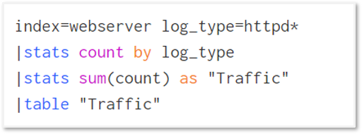
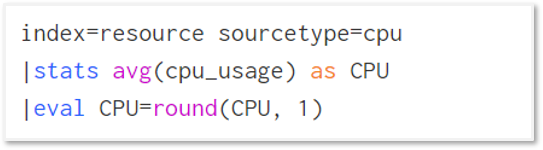
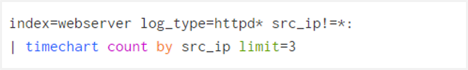
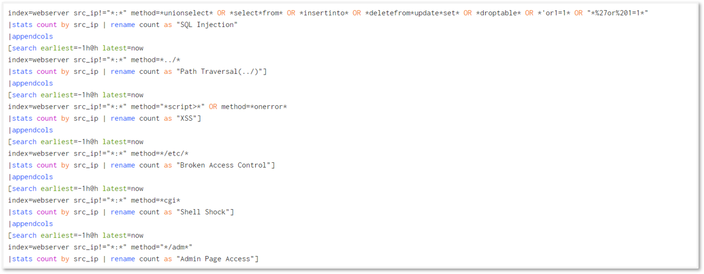
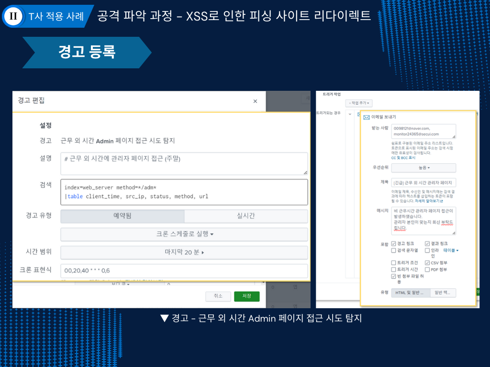
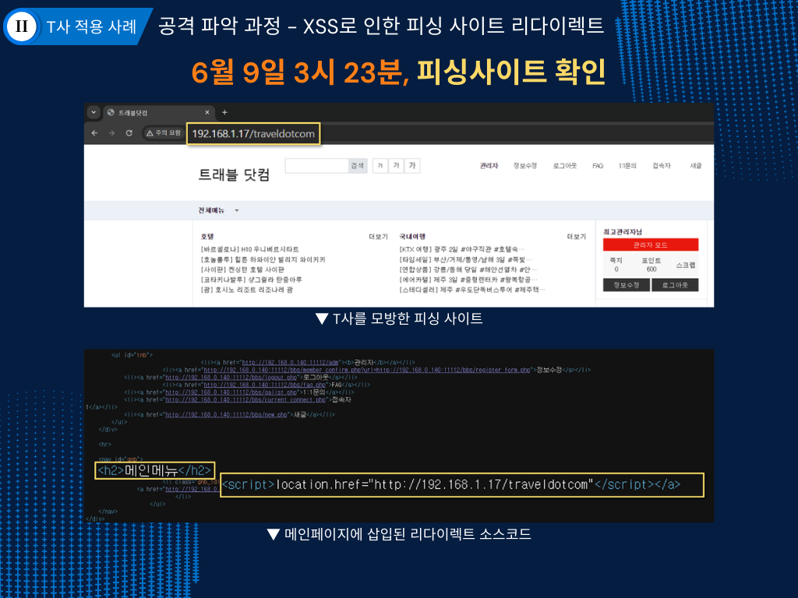
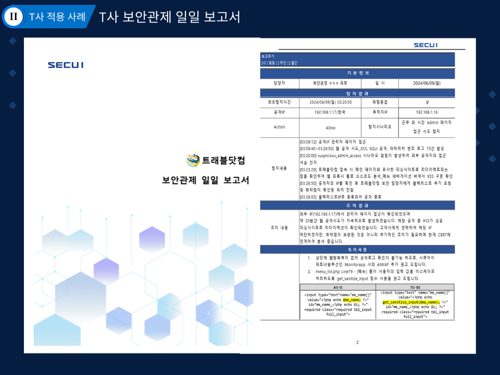
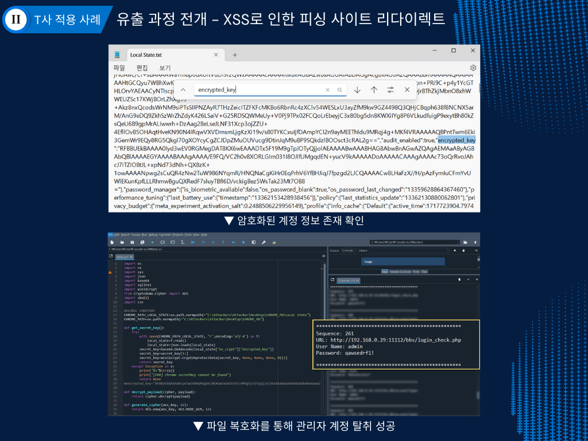
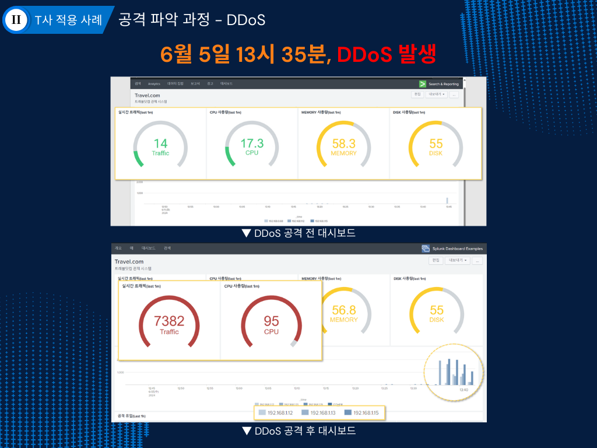
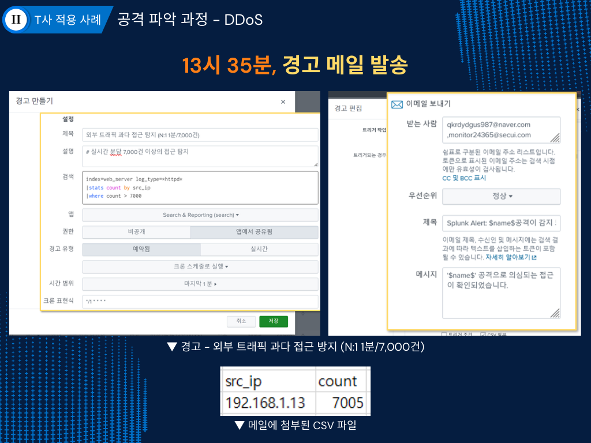

---
### 1. 수행목적 
Splunk를 이용한 공격성 트래픽 탐지로 실무역량 강화 
* 수행주제
> 시나리오1: admin페이지 내 XSS 취약점을 이용한 피싱사이트 리다이렉트 
> 시나리오2: 대시보드 지표를 활용하여 DDoS공격 탐지 
### 2. 수행계획수립 
* 수행인원: 시큐리티아카데미 시큐아이트랙 Team.Splunker(4명) 
* 담당파트: 대시보드 레이아웃 및 쿼리 개발, AES 복호화, 관제 일일보고서 제작, 발표 
* 수행일정(WBS) 
 
_이미지 클릭 시 새 창에서 확대_ 

* 아키텍처 
> 웹서버 syslog를 Forwarder를 통해 Indexer에 raw 데이터 그대로 저장하며, Searcher는 Master를 통해 Indexer에 있는 데이터를 SPL로 검색 
> Master가 Indexer와 Searcher를 중앙에서 컨트롤하므로 분산환경 구축 시 노드 추가가 용이  
* 네트워크 

 | Name  | IP | Port Forwarding |
 |:---------:|:------------:|:------:|
 | Forwarder | 192.168.1.11 | 11111 |
 | Indexer | 192.168.1.12 | 22222 |
 | Searcher | 192.168.1.13 | 33333 |
 | Master | 192.168.1.14 | 44444 |
 | Kali | 192.168.1.15 | - |
 | Webserver | 192.168.1.16 | 11112 |
 | Pishing Web | 192.168.1.17 | 11113 |

_VMWarePro에서 NAT모드 192.168.1.0대역으로 네트워크 구성_
 
* 실습환경 
> Web - CentOS7.9, GNUBOARD 5.2.6 
> Splunk - CentOS7.9, Splunk 9.2.1 
> AES 복호화 수행 - Anaconda Prompt, Spyder 
* 대시보드 구축 
> 실시간으로 변하는 대시보드를 구상하였으나, 웹 공격 유입량 테이블 검색 속도가 느려 1분 간격 새로고침으로 설정 
> JOIN을 사용하면 검색 시간이 길어지므로 최대한 사용을 지양하고 최적화할 수 있는 쿼리를 고민 

### 대시보드 쿼리 설명 

**실시간 접근 시도(1분) 수집** 
'index=webserver log_type=httpd* |stats count by log_type' 쿼리로는 log_type이 httpd:, httpd.service로 결과값이 여러 개였기에 count를 한 번 더 더하고 Traffic으로 이름 변경함. 

  
쿼리

  

**웹서버 리소스 사용량(1분) 수집** 
① 웹서버에 Splunk 설치 후 Splunk Add-on for Linux 앱 설치 
② 쉘 스크립트로 실시간으로 명령어 결과값을 Indexer로 전달(CPU는 top, Memory는 free, Disk는 df), Index=resource로 수집 
③ Searcher 대시보드에 Horseshoe meter 앱 설치 후, 아래 쿼리를 입력하여 리소스 사용량 출력 

  
쿼리

  

**시간 별 접근 시도(1시간/5분 단위) 수집** 
웹서버의 syslog 중 웹 로그를 대상으로 1시간 동안의 접근 시도를 타임 차트로 시각화한 것. 또한, limit 3 옵션으로 요청 건수 상위 3개 출발지 IP에 대해서 데이터 출력 

  
쿼리

  

**웹 공격 유입량(1시간) 수집** 
① Nikto, Nessus를 웹 서버에 사용 후 웹 공격 
② 스캐너가 남긴 웹 공격 시그니처를 바탕으로 필드 추출 
③ 필드 추출 시, 시그니처가 method로 추출되는 점을 감안하여 쿼리 제작 

  
쿼리

  

### 3. 시나리오 수행  
### 시나리오1 - admin 페이지 내 XSS 취약점을 이용한 피싱사이트 리다이렉트 
* 시나리오 전개 

① 한글2022 크랙버전을 위장한 인포스틸러 악성코드 다운로드로 웹서버 관리자 PC에 인포스틸러 설치 
② 인포스틸러로 브라우저 자동 로그인 파일이 유출되어 공격자가 관리자 계정 획득 
③ 사람이 적은 시간대를 노려 공격자가 관리자 페이지에 접근하여 Stored XSS로 피싱사이트 리다이렉트 코드 삽입 
④ 근무 외 시간에 관리자 페이지 접속 경고 메일로 관제실에서 외부 IP가 관리자 페이지 접근 사실 인지 
⑤ 메일에 첨부된 웹 로그로 공격 사실 확인하여 대응 
⑥ 익일 침해사고 관제 보고서 발송 

* 수행 과정 

**그누보드5.2.6 버전 취약점 검색 후 시나리오 기획** 
① 취약점 레퍼런스 탐색 후 최신 보안기사를 레퍼런스로 시나리오 기획 
② 웹사이트를 clone하여 피싱사이트 구축 
③ Stored XSS 취약점이 /adm/menu_list.php에 존재하는지 확인 후, 취약점이 존재하는 입력폼에 피싱사이트 리다이렉트 소스코드 삽입  
**근무 외 시간 관리자 페이지 접근 시나리오 트리거(이메일) 설정** 

  
트리거 쿼리

  

**메일 로그의 url과 메인 페이지 url 비교&메인페이지에 리다이렉트 소스코드 삽입 확인** 

  
url 비교&소스코드 점검

  

**관제 일일보고서 작성** 
① 시큐아이 보고서 표지와 병무청 사이버안전센터 관제보고서 양식을 결합 
② 위험등급, action값, 탐지시나리오 등 한눈에 파악해야하는 지표 추가 
③ 바디값이 남지 않는 한계점을 솔루션으로 권고, 그누보드5 깃허브 참고하여 시큐어코딩 가이드를 작성 

  
보고서

  

**Python으로 크롬 자동로그인 파일(Local State) 복호화_오픈소스 활용** 

  
복호화 이미지

  

* 시나리오1에서 참고한 페이지 
[(기사)성심당 해킹](https://m.boannews.com/html/detail.html?idx=129583,"성심당%20해킹") 
[(기사)유명 제품 크랙버전을 위장한 인포스틸러](https://m.boannews.com/html/detail.html?idx=128626,"유명%20제품%20크랙버전을%20위장한%20인포스틸러") 
[(기사)인포스틸러로 브라우저 자동로그인 파일 탈취](https://m.boannews.com/html/detail.html?tab_type=1&idx=127372,"인포스틸러로%20브라우저%20자동로그인%20파일%20탈취") 
[AES 패스워드 복호화](https://nampill.tistory.com/entry/%ED%81%AC%EB%A1%AC-%EB%B8%8C%EB%9D%BC%EC%9A%B0%EC%A0%80-%EA%B3%84%EC%A0%95%EC%A0%95%EB%B3%B4-%EC%B6%94%EC%B6%9C%EB%B9%84%EB%B0%80%EB%B2%88%ED%98%B8-%EB%B3%B5%ED%98%B8%ED%99%94,"") 
[그누보드5.2.6 취약점](https://github.com/gnuboard/gnuboard5/commit/630e39de16e61d6e0cc224028d20efb782436fba,"그누보드%20취약점")   

### 시나리오2 - DDoS 탐지 및 대응 
* 시나리오 전개 

① 대시보드로 대규모 접근 시도 횟수 확인 
② 동시에 경고 트리거로 인해 경고 메일 발송 
③ 메일로 1분동안 7,000건 이상의 접근 시도를 요청하는 IP와 요청 횟수 확인 
④ ISP 업체와 고객사에 IP차단요청 

* 수행과정 

**대규모 접근 시도 유입 시 대시보드** 

  
대시보드

  

**시나리오 트리거(이메일) 설정** 

  
트리거(이메일)

  

**최종 처리 과정 설정** 
웹서버 방화벽 권한은 관제실에 없어 ISP와 고객사에 차단 요청하는 것으로 마무리
